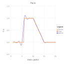
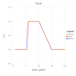

# Example Usage

Let's interpolate function ``f(x)``

```math
f(x) =
    \begin{cases}
       0 \, , &  1 \le x \lt 6 \\
       1 \, , &  6 \le x \le 10 \\
       -x/5 + 3 \, , &  6 \le x \le 15 \\
       0 \, , &  15 \le x \le 20 
    \end{cases}
```

by values of the function in knots ``\{1, 2, 3, ..., 20\}`` (case A) and by values of the function and values of its first and second derivatives in the same knots (case B).

```@meta
DocTestSetup = quote
    using NormalSplines
end
```

A)

```@example A
    using NormalSplines

    x = collect(1.0:1.0:20)       # function knots
    u = x.*0.0                    # function values in knots
    for i in 6:10
        u[i] = 1.0
    end
    for i in 11:14
        u[i] = -0.2 * i + 3.0
    end

    # build a twice-differentiable spline 
    # by values of function in knots
    interpolate(x, u, RK_W3())

    p = collect(1.0:0.2:20)        # evaluation points
    σ = evaluate(p)
    σ = nothing  # hide
```



Evaluate the spline at some points:

```@example A
    σ = evaluate([3.1, 8.1, 18.1])
```

B)

```@example B
    using NormalSplines

    x = collect(1.0:1.0:20)       # function knots
    u = x.*0.0                    # function values in knots
    for i in 6:10
        u[i] = 1.0
    end
    for i in 11:14
        u[i] = -0.2 * i + 3.0
    end

    s = x                         # function first derivative knots
    v = x.*0.0                    # function first derivative values
    for i in 11:14
        v[i] = -0.2
    end
    t = x                         # function second derivative knots
    w = x.*0.0                    # function second derivative values

    # build a twice-differentiable spline by values of function,
    # and values of its first and second derivatives in knots
    interpolate(x, u, s, v, t, w, RK_W3())

    p = collect(1.0:0.2:20)      # evaluation points
    σ = evaluate(p)
    σ = nothing  # hide
```



Evaluate the spline at some points:

```@example B
    σ = evaluate([3.1, 8.1, 18.1])
```

## Q & A

Q1. *Question*: The call

```julia
interpolate(x, u, RK_H3())
```

cause the following error: `PosDefException: matrix is not positive definite; Cholesky factorization failed.` What is a reason of the error and how to resolve it?

A1. *Answer*: Creating a Bessel Potential kernel object with omitted parameter `ε` means that this paramter will be estimated during interpolating procedure execution. It might happen that estimated value of the `ε` is too small and corresponding  Gram matrix of linear system of equations which defines the normal spline coefficients is very ill-conditioned and it lost its positive definiteness because of floating-point rounding errors.  

There are two ways to fix it.

- We can get the estimated value of `ε` by calling function `get_epsilon()`:

```julia
ε = get_epsilon()
```

then we could try to call the `interpolate` function with greater `ε` value of the reproducing kernel parameter:

```julia
interpolate(x, u, RK_H3(10.0*ε))
```

- We may change the precision of floating point calculations. Namely it is possible to use Julia standard BigFloat numbers or Double64 - extended precision float type from the package [DoubleFloats](https://github.com/JuliaMath/DoubleFloats.jl):

```julia
using DoubleFloats

x = Double64.(x)
u = Double64.(u)
interpolate(x, u, RK_H3())
```

This answer also applies to types `RK_H1()` and `RK_H2()`.

Q2. *Question*: The call

```julia
interpolate(x, u, RK_W3())
```

cause the following error: `PosDefException: matrix is not positive definite; Cholesky factorization failed.` How to resolve it?

A2. *Answer*: The reason of that exception is the Gram matrix of linear system of equations which defines the normal spline coefficients is very ill-conditioned and it lost its positive definiteness because of floating-point rounding errors.  

The only way to fix it - is using floating-point arithmetic with extended precision. It can be provided by Julia standard BigFloat type or Double64 type from the package
[DoubleFloats](https://github.com/JuliaMath/DoubleFloats.jl):

```julia
using DoubleFloats

x = Double64.(x)
u = Double64.(u)
interpolate(x, u, RK_W3())
```

This answer also applies to types `RK_W1()` and `RK_W2()`.

Q3. *Question*: The following calls

```julia
interpolate(x, u, RK_H3())
σ = evaluate(p)
```

produce the output which is not quite satisfactoty.
Is it possible to improve the quality of interpolation?

A3. *Answer*: Creating a Bessel Potential kernel object with omitted parameter `ε` means that this paramter will be estimated during interpolating procedure execution. It might happen that estimated value of the `ε` is too large and it is possible to use a smaller `ε` value which would result in better quality of interpolation. We can get the estimated value of `ε` by calling function `get_epsilon()`:

```julia
ε = get_epsilon()
```

and get an estimation of the problem's Gram matrix condition number by calling `get_cond()` function:

```julia
cond = get_cond()
```

In a case when estimated condition number is not very large, i.e. less than ``10^{12}`` using standard `Float64` floating-point arithmetic, we may attempt to build a better interpolation spline by calls:

```julia
interpolate(x, u, RK_H3(ε/5))
σ = evaluate(p)
```

Another option is using a smaller value of the `ε` and perform calculations using extended precision floating-point arithmetic.
